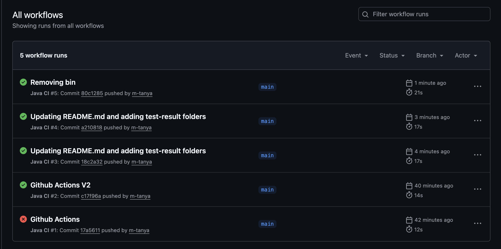

# Overview

This repository bundles two independent Java projects: a multithreaded producer/consumer demo and a sales analytics engine. Both come with runnable scripts, Dockerfiles, JUnit suites, and GitHub Actions automation so you can execute or extend either project on its own.

## Project Summaries

| Project | Description | Highlights | Artifacts |
| --- | --- | --- | --- |
| `consumer-producer` | Threaded workload transfer using a bounded queue guarded by classic `wait/notify` mechanics. | Java monitors, defensive lifecycle handling, integration + edge-case tests, terminal-friendly logging. | `scripts/run-demo.sh`, `scripts/run-tests.sh`, logs under `consumer-producer/test-result/`. |
| `data-analysis` | CSV-driven analytics pipeline that computes revenue, segmentation, trends, invoice aging, and profitability. | Java Streams, immutable domain model, 49 JUnit tests, comprehensive console report. | `run-tests.sh`, `compile.sh`, CLI `com.dataanalysis.app.Main analyze`, outputs in `data-analysis/test-result/`. |

Module-level READMEs hold deeper context plus screenshots/logs.

## System Design
1. **Separation of Concerns** – Each module is a self-contained Java project with independent `src/main`, `src/test`, scripts, Dockerfile, and test artifacts. There is no shared runtime code, simplifying reasoning about each domain.
2. **Execution Surface** – Local scripts mirror the Docker and GitHub Actions flows, so results are consistent across developer machines, CI, and containers.
3. **Observability** – All demos/tests print rich logs that are captured in `test-result/` directories. These files (`ci-run.log`, `demo-output.txt`, `analysis-report.txt`, etc.) double as reference output when discussing behavior.

## Running Locally

```bash
# Producer-consumer
cd consumer-producer
./scripts/run-demo.sh     # live demo with queue stats
./scripts/run-tests.sh    # compiles + JUnit suite

# Data analysis
cd ../data-analysis
bash run-tests.sh         # compiles + 49 JUnit tests
bash compile.sh
java -cp out com.dataanalysis.app.Main analyze data/sales.csv > test-result/analysis-report.txt
```

## Docker & Compose

```bash
docker compose build consumer-producer data-analysis
docker compose up consumer-producer                   # demo
docker compose run --rm consumer-producer-tests       # tests
docker compose up data-analysis                       # analytics suite
```

Use `docker compose logs > run.log` if you need to export output.

## GitHub Actions

`.github/workflows/java-ci.yml` runs both modules’ scripts in parallel on every push/PR. Job names match the folders (`Consumer Producer Tests`, `Data Analysis Tests`), providing fast feedback when modifying either codebase.

👉 Check the Actions tab in GitHub to view the latest workflow run logs and downloadable artifacts for each module.



## Testing & Output Artifacts

| Module | Command(s) | Captured Output |
| --- | --- | --- |
| Producer-Consumer | `./scripts/run-tests.sh` | `consumer-producer/test-result/ci-run.log` (JUnit tree), `consumer-producer/test-result/junit-output.txt` |
| Producer-Consumer Demo | `./scripts/run-demo.sh` | `consumer-producer/test-result/demo-output.txt`, `consumer-producer/test-result/output-*.png` |
| Data-Analysis Tests | `bash run-tests.sh` | `data-analysis/test-result/ci-run.log`, `data-analysis/test-result/demo-output.txt` |
| Data-Analysis Main Run | `java -cp out com.dataanalysis.app.Main analyze data/sales.csv --asOfDate=2025-11-25` | `data-analysis/test-result/analysis-report.txt` (full console report) |

These files are committed so reviewers can inspect actual console output without rerunning the scripts. Re-run any command above to refresh the logs before sharing updated results.

## Sample Outputs

Please check the respective test-result/ folders in each module for full console and JUnit logs.

### Producer-Consumer Demo
```
╔════════════════════════════════════════╗
║         Running Demo                   ║
╚════════════════════════════════════════╝

╔════════════════════════════════════════╗
║   Producer-Consumer Pattern Demo      ║
╚════════════════════════════════════════╝

Configuration:
  Items to transfer: 20
  Queue capacity: 5
  Producer delay: 50ms
  Consumer delay: 100ms
  (Consumer is slower - expect queue to fill up)

Starting producer and consumer threads...

[23:36:45] INFO: [Producer-1] Started
[23:36:45] INFO: [Consumer-1] Started
[23:36:45] INFO: [Producer-1] Produced item. Queue size: 1/5
[23:36:45] INFO: [Consumer-1] Consumed item. Queue size: 0/5
… (live production/consumption log)
[23:36:47] INFO: [Producer-1] Finished - produced 20 items
[23:36:47] INFO: [Consumer-1] Finished - consumed 20 items

=== Queue Statistics ===
[23:36:47] INFO: Capacity: 5
[23:36:47] INFO: Items produced: 20
[23:36:47] INFO: Items consumed: 20
[23:36:47] INFO: Current size: 0
[23:36:47] INFO: Items in transit: 0
[23:36:47] INFO: Closed: true

=== Results ===
Time elapsed: 2079ms
Source size: 0
Destination size: 20
Queue size: 0

Verification: ✓ SUCCESS
All 20 items successfully transferred!
```

### Data-Analysis Report Snippet
```
=== Sales Overview ===
Total Net Revenue: $1,785,120.58
Total Units Sold: 14,966
Average Order Value: $1,785.12
Average Selling Price per Unit: $119.28

=== Revenue by Segment and Region ===
Revenue by Product Category:
  Software: $474,954.76
  Service: $448,498.58
  Hardware: $442,609.78
  Subscription: $419,057.46

Revenue by Region:
  TX: $317,318.02
  WA: $311,355.32
  FL: $299,093.55
  CA: $294,326.04
  IL: $286,828.38
  NY: $276,199.27

=== Time-Based Trends (excerpt) ===
Revenue by Month:
  2024-01: $83,056.62
  2024-02: $106,521.28
  2024-03: $91,875.61
Month-over-Month Revenue Change:
  2024-02: $23,464.66 (28.25%)
  2024-03: $-14,645.67 (-13.75%)
```

### JUnit Test Run (excerpt)
```
Thanks for using JUnit! Support its development at https://junit.org/sponsoring

╷
├─ JUnit Jupiter ✔
│  ├─ SharedQueueTest ✔
│  │  ├─ testBasicPutGet() ✔
│  │  ├─ testConsumersReleaseWhenProducersDone() ✔
│  │  └─ testFifoOrdering() ✔
│  ├─ EdgeCaseTest ✔
│  │  ├─ testZeroCapacity() ✔
│  │  └─ testThreadInterruption() ✔
│  └─ ProducerConsumerTest ✔
│     ├─ testSingleProducerSingleConsumer() ✔
│     └─ testMultipleProducersConsumers() ✔
└─ JUnit Platform Suite ✔
Test run finished after 2.0 s
[        16 tests found           ]
[         0 tests skipped         ]
[        16 tests successful      ]
```

## Repository Layout

```
.
├── consumer-producer/
├── data-analysis/
├── docker-compose.yml
└── README.md
```

See the module READMEs for detailed setup notes, design diagrams, and troubleshooting tips.

